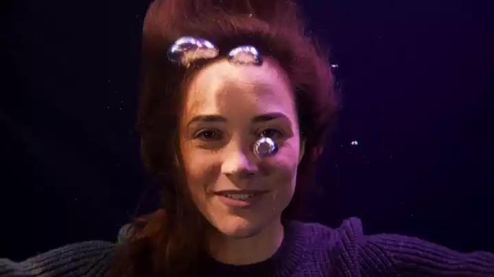
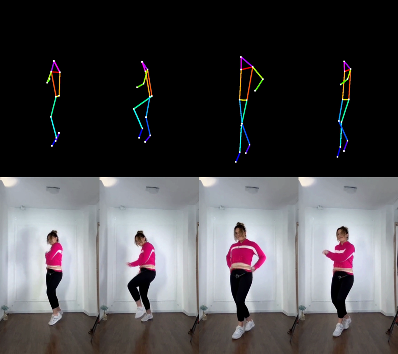
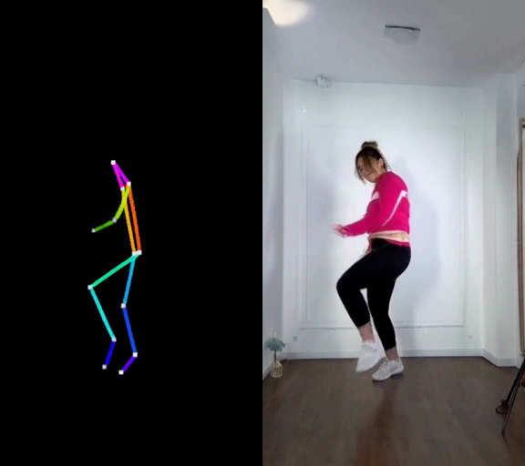

<div align="center">

<a href="https://huggingface.co/MiniMaxAI/MiniMax-H3">
  
</a>

# MiniMax H3 Agentic Trainer

**LoRA and IC-LoRA training for MiniMax-H3 - the open-weight 33B model that generates video *and* synchronized stereo audio.**

*Agentic because it is built to be driven without tribal knowledge: every capability labelled tested
or untested, every model-specific convention written down and pinned by a test, and the failure modes
made loud instead of silent.*

[](https://huggingface.co/MiniMaxAI/MiniMax-H3)
[](AGENTS.md)
[](https://github.com/Lightricks/LTX-2/tree/main/packages/ltx-trainer)
[](https://github.com/huggingface/diffusers)
[](LICENSE)

<sub>An independent, community trainer. Not affiliated with or endorsed by MiniMax.</sub>

</div>

---

### 📰 Announcements

* 🕺 **13 Aug 2026** - Pose control is available. [See it](#-ic-lora-structural-control)
* 🎭 **13 Aug 2026** - LoRA works. [Demo](#-demo)
* 🚀 **13 Aug 2026** - First release. LoRA and IC-LoRA for H3 on 48GB cards, without quantization.

---

<p align="center">
  
</p>

<p align="center">
  <video src="docs/demo/announcement.mp4" width="720" controls></video>
</p>

<p align="center">
  <sub><b>Everything above was generated by MiniMax H3</b> - picture, voice and underwater ambience in a
  single pass, 1024x576, no edit and no dub. <a href="docs/demo/announcement.mp4">Play it with sound.</a></sub>
</p>

---

## ⚡ TL;DR

- Train **LoRA** adapters on H3 - character, style, image-to-video, video-to-audio. Demonstrated
  end to end below.
- Train **IC-LoRA** adapters, where a reference image/video/audio is packed *in-context* into the
  sequence - the one thing no other public H3 trainer implements. Demonstrated on skeleton-to-video,
  see [IC-LoRA](#-ic-lora-structural-control).
- Configs, ergonomics and CLI shaped after LTX-2's `ltx-trainer`; numerics shaped after H3, which
  differs from ordinary flow matching in ways that silently corrupt weights.
- **Built to be driven by an agent.** Unknown config keys fail at load rather than six hours in;
  `--print-config` and `--set key=value` make every run reproducible from one line; metrics are JSONL;
  the H3 conventions that silently corrupt a run are documented *and* pinned by tests; and anything
  never actually run is [labelled untested](docs/hardware.md#untested) rather than implied to work.
- Runs on **48GB cards** - the 66GB bf16 transformer is split across GPUs in one process, no
  quantization required.
- Every checkpoint exports a **ComfyUI-loadable** adapter, bit-exact.

```bash
git clone https://github.com/AviadDahan/MiniMax-H3-Trainer.git && cd MiniMax-H3-Trainer
bash scripts/install_env.sh && source scripts/env.sh    # environment, caches on /data
bash scripts/download_model.sh                          # weights (~210GB)

python scripts/process_dataset.py dataset.json --model-path $H3_MODEL_PATH \
    --resolution-bucket 704x704x124 --decode 2          # cache latents, eyeball the round-trip
python scripts/train.py configs/character_av_lora.yaml  # train
python scripts/generate.py --prompt "..." --lora runs/.../checkpoint-0000600 --ab --out out.mp4
```

Prerequisites: Linux, CUDA, Python 3.11+, `ffmpeg`/`ffprobe` on `PATH`, and either ≥2 GPUs of 48GB or
one 80GB card. Full walkthrough: [docs/quick-start.md](docs/quick-start.md).

---

## 📚 Documentation

| you want to | read |
|---|---|
| run something end to end for the first time | [quick-start.md](docs/quick-start.md) |
| turn footage into a dataset | [dataset-preparation.md](docs/dataset-preparation.md) |
| pick a training mode, or add one | [training-modes.md](docs/training-modes.md) |
| know what a config key does | [configuration-reference.md](docs/configuration-reference.md) |
| generate, A/B an adapter, export to ComfyUI | [inference.md](docs/inference.md) |
| choose a strategy for the cards you have | [hardware.md](docs/hardware.md) |
| understand *why* the numerics look unusual | [h3-quirks.md](docs/h3-quirks.md) |
| diagnose an OOM, a hang, or output that is subtly wrong | [troubleshooting.md](docs/troubleshooting.md) |
| know what each script does | [scripts.md](docs/scripts.md) |
| see what a finished run looks like | [artifacts/README.md](artifacts/README.md) |

**Working on this with an agent?** Start with [AGENTS.md](AGENTS.md) (the invariants and the traps)
and [CLAUDE.md](CLAUDE.md) (how to drive this repo). Three skills ship in `.claude/skills/`, mirrored
at `.agents/skills/`: `h3-dataset-prep`, `h3-prompt-writing` and `h3-lora-run`.

---

## 🎬 Demo

<!-- DEMO:START -->
A character AV LoRA trained with this repo: **36 clips, rank 16, 1200 steps, ~6 h on 4×A6000**. The
character is synthetic - invented from a text description, generated with H3 itself, so no real
person's likeness or voice is involved ([how](docs/dataset-preparation.md#generating-a-character-dataset)).

**Identity holds across scenes.** Anchor on the left; two generations from the finished adapter in
unrelated settings, same seed family, neither scene in the training set:


**The trigger does the work.** Same prompt, same seed - **base on the left, adapter on the right**.
`OHWXMIRA` turns a canal landscape into the character, speaking:

<p align="center">
  
</p>
<p align="center">
  <video src="docs/demo/character_ab_canal.mp4" width="720" controls></video>
  <br><sub><a href="docs/demo/character_ab_canal.mp4">canal A/B with sound</a></sub>
</p>

The same adapter in a scene the dataset never contained - the face carries over, the workshop does not
come from the training clips:

<p align="center">
  
</p>
<p align="center">
  <video src="docs/demo/character_workshop_lora.mp4" width="480" controls></video>
  <br><sub><a href="docs/demo/character_workshop_lora.mp4">workshop with sound</a></sub>
</p>

**And it stays contained.** No trigger, base left, adapter right. A character LoRA that quietly
rewrites every *other* prompt is a broken one:

<p align="center">
  
</p>
<p align="center">
  <video src="docs/demo/character_ab_control.mp4" width="720" controls></video>
  <br><sub><a href="docs/demo/character_ab_control.mp4">control A/B with sound</a></sub>
</p>

Each pair above is a silent animated preview and the clip itself. **Play the clips** - H3 generates
picture and 32kHz stereo in one pass, and a still cannot show half of what the adapter learned.

Held-out video loss: 0.454 → 0.2675 (150) → 0.2415 (450) → 0.2430 (800) → **0.2356 (1200)**. Note the
run looked converged from 450 to 800 and then improved again - one reason `plot_metrics.py` reports a
sigma-controlled trend rather than a raw curve.

**What this does not show.** Voice identity is unverified: the clips carry speech and the audio branch
trains, but "does it sound like the same person" was never measured, only that speech is present and
in the expected band. The adapter also learns the anchor's wardrobe along with the face, which is what
36 clips of one outfit buys you. And none of this says anything about *real* footage - the whole dataset
came out of H3, which is a clean test of the trainer and an easier problem than the real thing.
<!-- DEMO:END -->

---

## 🔍 What it does

MiniMax released H3's weights "to support further development, including fine-tuning" but shipped no
trainer, and the diffusers integration is inference-only. This is the trainer.

| | |
|---|---|
| **training modes** | t2va, i2v/fl2va and v2a from one `flexible` strategy; a2v and first+last-frame are expressible in the same schema but ship no config and have never been run |
| **reference conditioning** | reference image/video/audio packed in-context and masked from the loss; skeleton control [demonstrated](#-ic-lora-structural-control) |
| **prompt vision blocks** | keyframes and references appear in the conditioner's presentation, tagged as video |
| **configuration** | YAML, validated - unknown keys fail at load, not six hours in |
| **data** | offline two-pass latent cache; VAE round-trip verification built in |
| **batching** | layout-bucketed sampler, per-epoch shuffling, gradient accumulation |
| **acceleration** | model-parallel bf16 (the path everything here ran on) and DDP; ZeRO-2/3 and int8/fp8 quantization are implemented but [untested](docs/hardware.md#untested) |
| **checkpoints** | trainable tensors only; exact resume of weights, optimizer, scheduler and step |
| **logging** | text + JSONL + W&B, with video and audio losses kept separate |
| **validation** | held-out loss on a seeded sigma grid, and real generation with a same-seed A/B |
| **export** | ComfyUI-loadable adapters, Q/K/V re-fused, bit-exact |
| **inference** | multi-GPU sharded generation, same-seed A/B with the adapter on and off |

### How it works, in one paragraph

H3 denoises **one packed sequence** holding text, conditioning and both target modalities at once:

```
[ text | conditioning blocks | target audio | target video ]
```

Training has to reproduce that layout exactly - including the parts that are inverted relative to
every other flow-matching trainer. Time runs as `t = 1 − σ`, the model predicts a data-ward velocity
`v = x₀ − ε`, video and audio are noised at *different* sigmas drawn from a single uniform, and
reference rows are inputs that never enter the loss. All four fail silently when you get them wrong.
**[docs/h3-quirks.md](docs/h3-quirks.md) is the one page to read before changing anything numeric**;
[docs/troubleshooting.md](docs/troubleshooting.md) is where the symptoms are indexed.

---

## 🕺 IC-LoRA: structural control

H3 ships no ControlNet and no pose, depth or edge input. IC-LoRA is how you add one: render the
control signal as a video, pack it into the sequence as an in-context reference, and train an adapter
to follow it. **Nothing else public trains this on H3.**

Trained on 92 skeleton/footage pairs at 320x576x124, rank 32. The reference below is a **held-out**
clip that was never encoded, so following it cannot be memorization:

<p align="center">
  
</p>

<sub>Top: the held-out skeleton. Bottom: generated from it at 576x1024. The adapter trained at
320x576, so the control transfers to resolutions it never saw.</sub>

**The control.** Give the *base* model the same skeleton and the same seed with
no adapter, and it reproduces the skeleton rather than generating anything from it. The adapter is
what converts a reference from something to copy into something to obey:

<p align="center">
  
</p>

<sub>Left: base model, same reference and seed. Right: with the adapter.</sub>

Held-out video loss 0.5079 → 0.2607 by step 150, with the largest gain at high sigma, where the
reference carries most of the usable signal.

**What this is not.** The adapter itself is **not published**: it was trained on scraped short-form
video whose subjects did not consent to being training data, which our own
[ethics section](#-ethical-considerations) rules out. What ships here is the pipeline and the results.
Output is soft because 320x576 is well below H3's native 768 short edge, a throughput choice
(a reference costs as many rows as the target, and attention is quadratic), not an adapter limitation.

Reproduce it with [`scripts/extract_pose.py`](scripts/extract_pose.py) and
[`configs/pose_ic_lora.yaml`](configs/pose_ic_lora.yaml); see
[docs/training-modes.md](docs/training-modes.md#structural-control-pose-depth-edges).

---

## 📊 Results

What has actually been measured on this hardware, not claims:

| check | result |
|---|---|
| VAE round-trip (video) | 22.8 dB PSNR on a hard synthetic pattern; colour, geometry and motion intact |
| VAE round-trip (audio) | dominant frequency preserved (439.5 Hz), 0.82 waveform correlation |
| Overfit test (numerics proof) | video loss −25% to −77% within matched sigma bins over 150 steps; sigma-controlled trend −0.673 |
| IC-LoRA, skeleton control | 92 pairs, 320x576: generations follow a **held-out** skeleton, while the base model given the same reference reproduces it instead. Held-out loss 0.5079 → 0.2607 by step 150 |
| ComfyUI export | bit-exact against the PEFT weights (max abs difference 0.000e+00) |
| Character LoRA | 36 clips, rank 16, 1200 steps: identity holds across unseen scenes, control prompts unchanged; see [Demo](#-demo) |
| Unit tests | 52 passing, `ruff` clean |

Everything that has *not* been run is listed in the
[untested list](docs/hardware.md#untested) rather than left to look like it works.

---

## 🗺️ Roadmap

Deliberately short. This is a trainer, not a platform.

- [x] **IC-LoRA demonstrated** - skeleton control, generating from a held-out reference.
- [ ] **A publishable adapter** - the demonstrated one trained on scraped video and is deliberately
      not released; retrain on synthetic or consented footage and publish the weights.
- [ ] **Close the two known conditioning gaps** - a reference-free prompt embedding for the dropout
      branch, and keyframe framing that matches the inference path.
- [ ] **Ship configs for `a2v` and first+last-frame**, the two modes the schema already expresses.

---

## ⚖️ Ethical considerations

This trains models that reproduce a specific person's **appearance and voice** together. That is
straightforwardly dual-use.

- Train on people who have **explicitly consented**, or on synthetic identities. The character example
  here is synthetic on purpose - invented from a text description, not a real person.
- **Label generated media** as synthetic when you publish it.
- Non-consensual likeness or voice cloning, impersonation and fraud are out of scope for this project
  and prohibited by the base model's licence.

---

## 🙏 Acknowledgements

- **MiniMax** for [H3](https://huggingface.co/MiniMaxAI/MiniMax-H3) and for releasing the weights.
- **Lightricks** for [LTX-2's `ltx-trainer`](https://github.com/Lightricks/LTX-2/tree/main/packages/ltx-trainer),
  the design reference for the config schema, the flexible strategy and the overall shape of this tool.
- **[MiniMax-H3-FineTuning](https://github.com/IAmIronMan42/MiniMax-H3-FineTuning)** for `FIXES.md` -
  H3's numeric conventions, the ZeRO-3 landmines, and the measured ~70k-token sequence ceiling,
  summarised in [docs/h3-quirks.md](docs/h3-quirks.md#measurements-from-prior-work).
- **HuggingFace** for the diffusers H3 integration this builds directly on.

## 📄 License

**This code: Apache-2.0.** Written for this repository; no source was taken from either reference
project. `ltx-trainer` informed the *shape* of the config schema and the single-strategy design, which
the acknowledgements state plainly, and MiniMax-H3-FineTuning contributed *facts about the model*
recorded in [docs/h3-quirks.md](docs/h3-quirks.md). Neither contributed code.

Dependencies are permissive (Apache-2.0, BSD, MIT), including the pinned diffusers commit.

**Things this licence does not cover:**

| | governed by |
|---|---|
| the MiniMax-H3 weights | [MiniMax H3 Community License Agreement](https://huggingface.co/MiniMaxAI/MiniMax-H3/blob/main/LICENSE) |
| adapters you train, and anything H3 generates - including the demo clips in `docs/demo/` | the same agreement, as model output |
| datasets you build | whatever licence the source footage carries; scraped video usually is not yours to redistribute |

The banner at the top is MiniMax's, hotlinked from their model card rather than redistributed.
